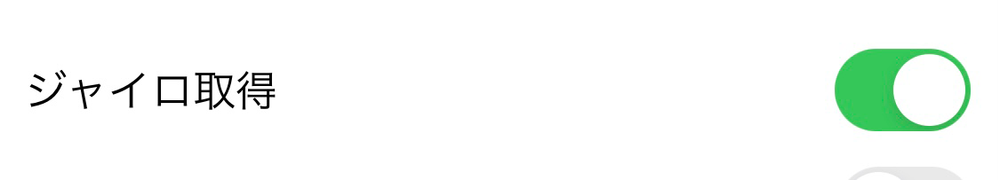
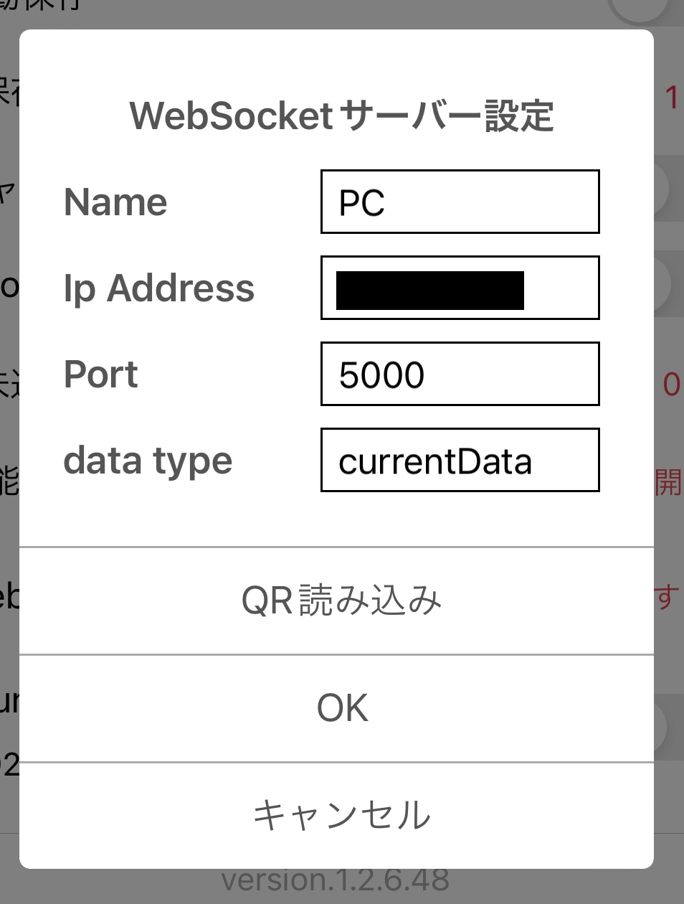
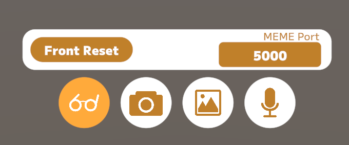
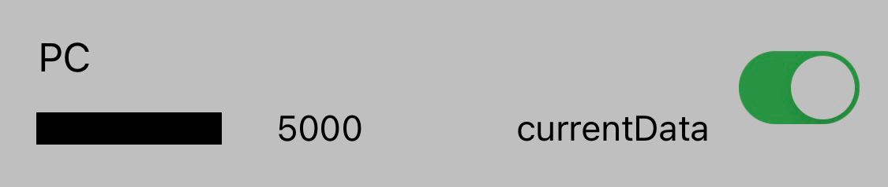

# セットアップ 🔧

セットアップについての詳細な解説ページです。

## 前提

本セットアップを行う前に、購入時についてきた説明書を見ながら初期セットアップを行ってください。

## 1. JINS MEMEのファームウェア更新

ファームウェア更新によってまばたきの取得の精度などが上昇するため、まず最初にアップデートを行うことを推奨しています。  
ファームウェア更新は、iOSまたはAndroidアプリで可能です。

ファームウェアアップデートの方法や、更新による変更点・注意事項については公式HPをご確認ください。  
https://jinsmeme.com/media/2022-11-fwapp

- iOS: https://apps.apple.com/jp/app/jins-meme-firmware-update/id1645259379
- Android: https://play.google.com/store/apps/details?id=com.jins_meme.dufStore

## 2. Loggerアプリの準備

MEMEをセットアップした端末に公式のLoggerアプリをインストールします。

- iOS: https://apps.apple.com/jp/app/jins-meme-logger/id1537937129
- Android: https://play.google.com/store/apps/details?id=com.jins_meme.logger4internal

Loggerアプリを立ち上げると「検索」ボタンが出てくるため、検索を行いデバイスが表示されるのを待ちます。  
デバイスが表示されたらタップして、「接続する」を押してください。

接続を行ったら、設定をタップし、「ジャイロ取得」をONにします。

次にWebSocketクライアントの「追加する」ボタンを押します。  
サーバー設定が表示されたら、以下の通り設定を行います。

| 設定項目       | 内容                                                                        |
|------------|---------------------------------------------------------------------------|
| Name       | 任意の名前(自分が分かりやすいように接続名を指定してください)                                           |
| Ip Address | 接続先PCのIPアドレス [よく分からない場合はこちら](https://www.cman.jp/network/term/ip/p2/) 
| Port       | 接続先PCのポート番号 (自由に設定して大丈夫ですが、Streamemeの初期ポートは **5000** になっています)         |
| data type  | currentData                                                               |

設定が完了したら、OKを押して確定します。  
※iOSでキーボードが表示されたままでOKボタンが埋もれている場合、キーボード右下のreturnを押すと引っ込みます

## 3. Streameme側の設定

Streamemeを起動します。  
メガネのマークのアイコンをクリックして接続設定を開き、ポート番号をLoggerアプリで設定した番号に合わせます。

Loggerアプリで先ほど設定した接続先をONに切り替えると、自動的に接続されます。

接続を行ったら、VRMを読み込んで動作を確認してみてください。

